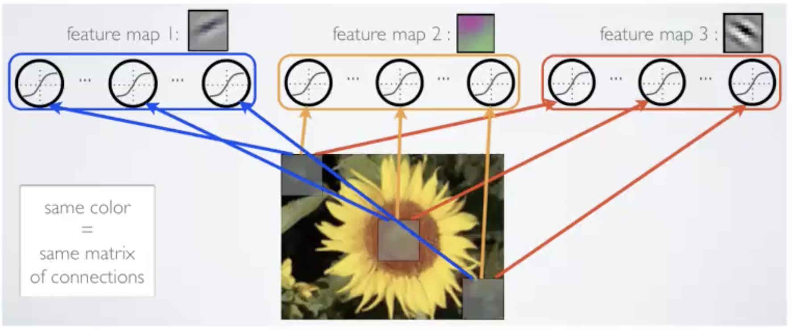
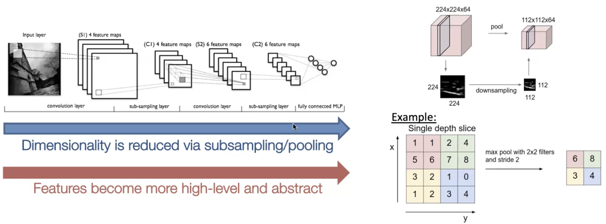
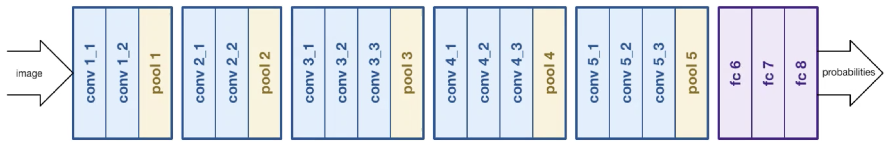
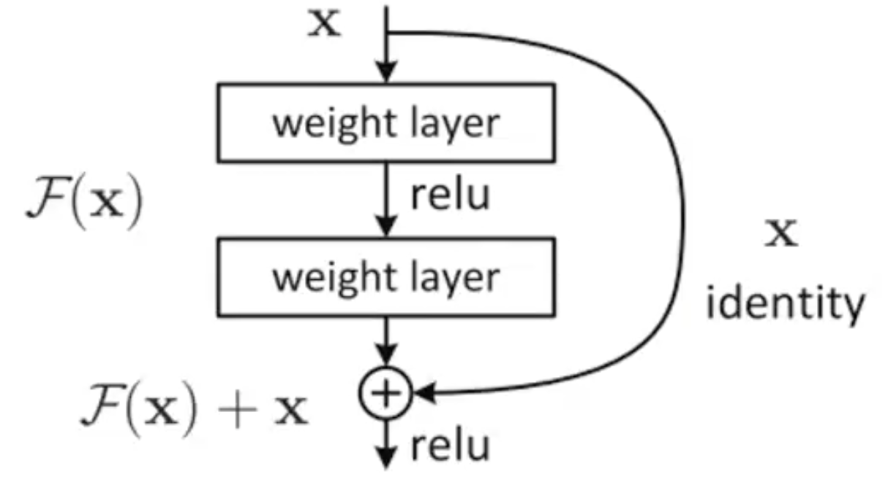

# Convolutional Neural Networks

This discussion is in the context of Supervised Learning tasks in Computer Vision.

The deep learning objective:
- Start with raw input data and automatically learn abstract concepts and useful features.

ImageNet Challenge:
- 1.2 million images; 1 thousand object categories; Scale was huge in 2011; http://www.image-net.org
- Goal is to classify the type of object in an image

NN Challenges dealing with Computer Vision:
- Scale: high-dimensional inputs. a small 150x150 px image has 22500 inputs. 22500x3 for RGB.
  - Not feasible to run fully-contected networks on large images
- 2D topology of pixels (3D for video): there is relationships between nearby pixels.
- Invariances to variations, like scale, translation, illuination, rotation, etc
  - We want architectures for CV that can handle these "Inductive Biases" [[inductive-bias]]

## CNN Architecture
- Your input is now a tensor (2D image with possibly multiple color channels)
- Each layer transforms an input 3D tensor to an output 3D tensor using a differential function
    - each hidden layer has a height and width, but also has depth (which are number of channels or feature representations)

Convolutional Neural Networks leverage several ideas
1. Local Connectivity - nearby pixels are related (local receptive fields)
- Each hidden unit is connected to a patch of the input (or previous layer). Units are connceted to all channels of a patch.
  - Contrast to fully connected NNs where each hidden unit is connected to each input.
2. Parameter Sharing - This is to handle the dimensionality of the inputs
- Share matrix of parameters across units
- Each hidden unit is responsible for its own patch, but multiple hidden units share parameters. Then we can have multiple groups of hidden units (additional feature maps)

3. Pooling/subsampling of hidden units in same neighbourhood - a way to reduce the input and representations size as we go further into our network
- As we go down the CNN layers: Dimensionaity is reduced via subsampling/pooling, as the Features become more high/level and abstract.

How it works in detail:
- We group the input units together, and apply the same function to these different groups.
$$ h_1 = \phi(w^\top [x_0, x_1] + b) $$
$$ h_2 = \phi(w^\top [x_1, x_2] + b) $$
- ^ This is the idea of parameter sharing and local receptive fields
- The parameters of the hidden units are shared, but the inputs to each hidden unit are different and local
    - So we can have many hidden units, without needing a ton of parameters
- Mathematically equivalent to a discrete **convolution operation**
    - Goal is to learn convolutional "kernels" that extract useful information: like blurs, edge detectors, etc
- We can vary the size of the receptive field (kernel), we can vary the stride (spacing between receptive fields), stack multiple conv layers, apply multiple convolutions to the same input, zero padding the edges, etc.

- Pooling:
  - often inserted between convolutional layeers. Usually takes the **max** of inputs in a receptive field.
    - less popular in last couple of years. More likely to use strided convolutions instead.

CNNs: Putting it all together
- Alternate betweeen convolutional and pooling layers, and fully connceted layers at the end.
- Trrain full network using **backpropogation**

## CNN Architecture History
1. Supervision - a.k.a AlexNet - 2012
  - Trained with stochastic gradient descent on two GPUs. 650k neurons, 60M parameters, 630M connections
  - Five convolutional layers, some max pooling in between, two fully connected layers, 4096 dimensional final feature layer.
  - First conf layers learn interesting kernels/features/patterns
  - Drastically outperformed the competition. Marked thes start of "deep learning" era of machine learning.
    - Instead of hand-crafted features with SVMs

2. VGG Net - 2014
  - Fairly deep: 16 layers (excluding pooling) - 13 conv, 3 fc
  - 3x3 convolutions only
  - 138 million parameters
  - **Pre-trained model is freely available, and is a standard in CV**
    - A common starting point for vision DL tasks

3. ResNet - 2015 (Resideual networks)
- Existing models weren't able to scale to deeper architectures. A 34 CNN doesn't do well.
- Simple idea
  - Add "skip" or "residual" connections between layers. Allows for much deeper models with **hundreds or thousands** of layers. Key component in most state of the art CNNs.
  - Basically you add the input to your convolutional output.

    - Discuss this issue in RNN lecture

Recent models beat (non-expert) human error.
- Just means that it beat non-expert humans in this particular dataset.
- Machines and humans makee different kinds of mistakes.

Advanced CNN applications
- Image Captioning: generating captions for images
- Scene parsing: identifying and locating objects (YOLO, etc)
- CNNs useful beyond vision: can also be used for some text tasks (like sentiment classification); and becoming the standard in audio tasks

### CNNs - Practical tips
- Architecture: filters(start small. e.g: 3x3, 5x5), pooling, number of layers (start small, add more)
- Read papers, copy their method, then do local research
- Consider starting with VGGNet!
- Consider using **dropout** and/or **BatchNorm**: important and popular technques

Dropout Regularization:
- More general than L2 regularization
- independently mask hidden units during training (replace with zero) randomly with probability p.
    - Apply during training but not in testing
- Effect: it can greatly reduce overfitting and helps generalize.

Batch Normalization: [[dl-batch-norm]]
- Proper scaling/normalization is important not only at input, but to all layers of deep NN. Makes SGD easier.
- So we apply BatchNorm to all (or some) of the layers:
    - For each mini-batch of data, at each layer k of the network:
        - Normalize each input using empirical batch statistics (mean, variance)
        $$ x_{hat}^{(k)} = \frac{x^{(k)} - E[x^{(k)}]}{\sqrt{VAR[x^{(k)}]}} $$
        - Output has tunable parameters ($\gamma, \beta$) for each layer ($y^k = \gamma^k . x_{hat}^{(k)} + \beta^k$)
- Effect: More sttable gradient estimates, especially for deep networks.

## References:
1. ML 451 lecture 23
2. A good survery paper: [Bengio, Courville, Vincent. Representation learning: A Review and New Perspectives. 2013](http://arxiv.org/pdf/1206.5538v2.pdf)

[//begin]: # "Autogenerated link references for markdown compatibility"
[inductive-bias]: inductive-bias.md "inductive-bias"
[dl-batch-norm]: dl-batch-norm.md "Batch Normalization (DL)"
[//end]: # "Autogenerated link references"