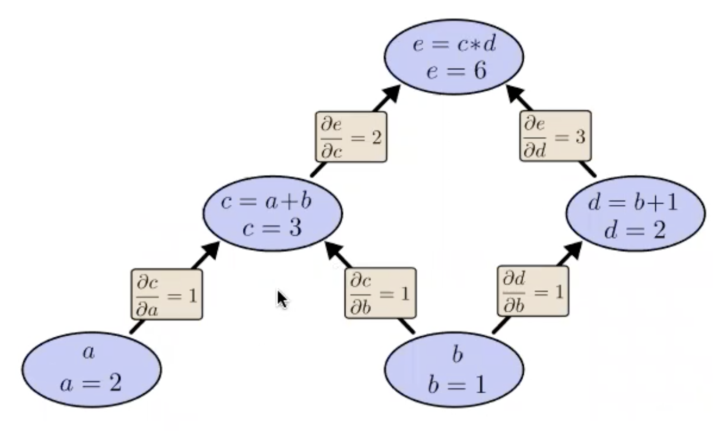
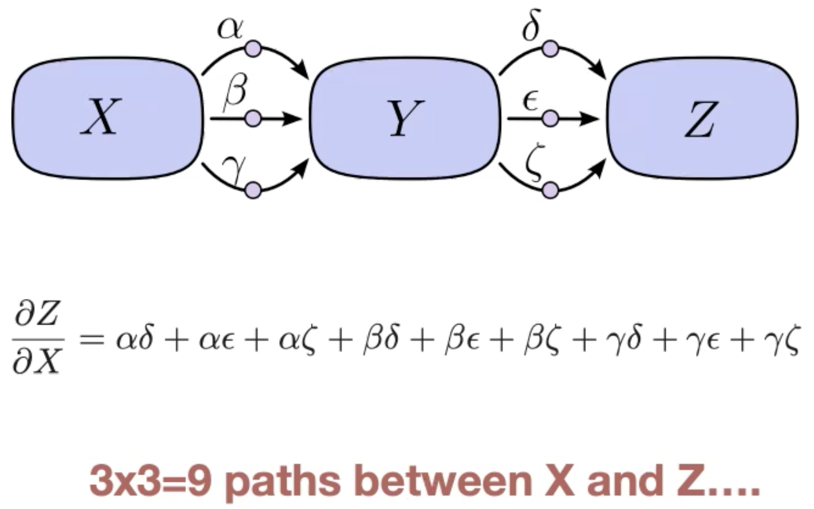
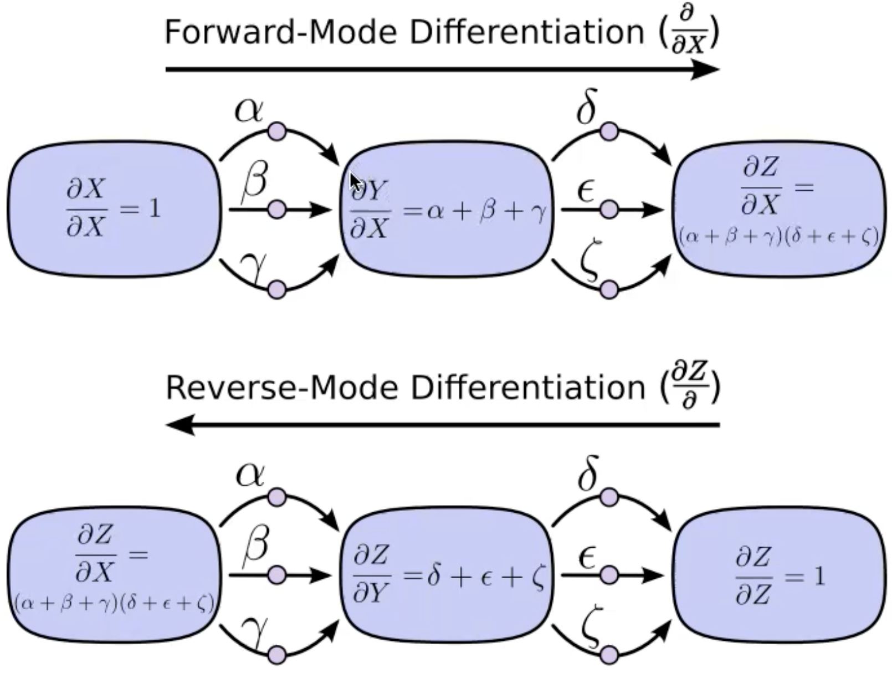

# Backpropagation - Optimizing Neural Networks

## Neural Networks review
[[neural-networks]]

## Automatic Differentiation (auto-diff)
How do we train complex NN models?
- As long as all operatiosn are differentiable (or sub-differentiable) we can just apply chain rule and compute derivatives
- But manually computing gradients is tedious: buggy, and re-do for every change in architecture.
- Solution: automatically compute the gradient

### Computation Graphs
Neural Networks are Computation Graphs. The graph nodes are computations, and edges are data flows. Feedforward NNs are a DAG computation graph.

The forward pass: setting the variable values in the **source** nodes, then propagate through the graph and get all values to the **sink** node.

Can use basic calculus to compute derivatives on the edges. Derivate tell us: If I change one node by **one unit**, how much does this impact another node.

Computing derivative between distance nodes: Sum of all possible paths between the two nodes, and for each path multiply the partial derivatives on each edge along the path. (this is basically the chain rule). e.g:

$$ \frac{\partial{e}}{\partial{b}} = 1 * 2 + 1 * 3 $$

### Challenge: Combinatorial Explosion
Number of paths between two nodes can be exponential iin the number of graph edges. Naively summing over paths can lead to combinatorial explosion.

Solution is to factor the paths:
$$ \frac{\partial{Z}}{\partial{X}} = (\alpha + \beta + \gamma)(\delta + \epsilon + \zeta) $$

Factoring Paths - Forward and Reverse mode autodiff

**Reverse-mode** automatic differentiation (RV-AD) is useful in NNs because in one pass it calculates the partial derivative of output(loss) to every node in the computation graph.

In the context of NNs and DL, we refer to RV-AD as **"backpropogation"**.

### Autodiff frameworks
- Now part of moden DL frameworks -  TensorFlow, PyTorch, mxnet, Theano, Jax, etc. They hard code basic derivative kernels, and use RV-AD.
- You specify:
  - The forward model computation graph (aka the architecture)
  - Tarining data and schedule (batch, minibatch, etc)
  - Optimization details (loss function, learning rate, optimizer)
- Framework compuutes derivatives and takes care of the rest
- Historically: Not long ago grad students had to manually derive gradients and write unit tests to verify them. UdeMontrreal first introduced autodiff in Theano, and inspired other frameworks.

## Convergence of Backpropagation
If the learning rate is appropriate, you are guaranteed to converge to a local minimum
- no guarantee of global minimum. There can be MANY local minima.
- Can use random restarts - i.e multiple retrains with different initial weights
- > In practice, the solution found is often good (typically local minima are not a huge problem in practice)

Training can VERY SLOW. But inference is fast.

### Choosing the learning rate
Backprop is very sensitive to the learning rate. Too large -> divergence. Too small -> Slow learning. It also influences ability to escape local optima.

So we use **Adaptive** optimization algorithms
- Idea: modify the learning rate adaptively depending on how training is progressing
- Popular approaches: [[Adam]], RMSProp, AdaGrad; Adam is *de facto* standard for DL.
  - They maintain a history of each parameter's history of gradient updates (usually using an exponential moving averages).
  - They scale the learning rate for each parameter based on its history. **Intuition:** Increase update strength for parameters that had smaller udpates in the past, and vice versa.

### Momentum
Vanilla SGD, you compute gradient and update weights based on current mini-batch.
$$ \Delta_i \mathbf{w} = \alpha \frac{\partial{J}}{\partial{\mathbf{w}}} $$
Idea is to add a second **momentum** term based on previous updates:
$$ \Delta_i \mathbf{w} = \alpha \frac{\partial{J}}{\partial{\mathbf{w}}} + \beta \Delta_{i-1}\mathbf{w} $$
Pros:
- More likely to pass small local minima
- Keeps weights moving in areas where the error is flat

Cons:
- With too much momentum, can get out of a global optima
- Yet another parameter to tune, and more chance of divergence.

### Overtraining
As training progresses, the network has more active parameters. It leads to overfitting.
- **Early-stopping**: Use a validation set to decide when to stop.

## References:
1. ML 451 lecture 22

#neural-networks #gradient-descent #backprop #backprop/autodiff #backprop/adam #backprop/momentum

[//begin]: # "Autogenerated link references for markdown compatibility"
[neural-networks]: neural-networks.md "Artificial Neural Networks"
[//end]: # "Autogenerated link references"