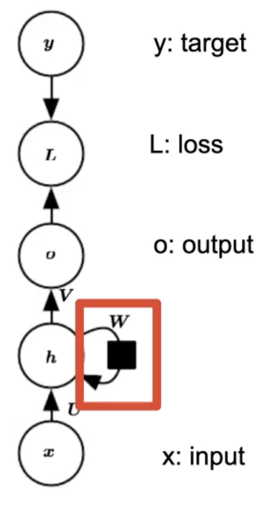

# Recurrent Neural Networks

Sequential data: Text, time series, etc.

We want models that can work with sequential data, and can exploit their sequential nature.

How we could we handle sequential data with a feedforward network:
- Take last N words/entries or their vectors and conctenate them
- Or take average of their vectors
- Or throw away sequence information, such as bag of words

So we want models that exploit sequential data, and also can consider information from a variable sized context window.

## RNNs
We will be adding cycles (with a **time delay**) in our network.
- Cycles are inputs from previous time steps (represented as a black box), making the computation tractable. This is called **Recurrence**.
- $h_t$ is referred to as *hidden* state at time t, it represents useful information from past inputs.

$$ h_t = \sigma(W h_{t-1} + U x_t + b) $$
$$ o_t = \phi(V h_{t} + c) $$
The above equation is recursive. The hidden state computation is a function of the information at previous time step, and the input at current time step.

The RNN is unrolled over time to form an acyclic graph, that looks like a feedforward network.

Two kinds of outputs with RNNs:
1. One target at the end of the sequence. E.g: Sentiment classification
2. A target at each time step. E.g: Language modeling/generation.
    - Language Modeling [[nlp-language-modeling]] is

RNNs can be thought of as being similar to Hidden Markov Models. The hidden state is learned.

Two questions I have:
- How does initial hidden layer h_0 get its value? is it always fixed? and is it random initialized? I assume it is not learned.
- Can recurrence look at more than most recent time step?

### Training RNNs
Same as feedforward networks: train with backpropagation [[nn-backpropogation]] on unrolled computation graph.
- Backpropagation thrugh Time (BPTT)
- Same derivation as regular backprop (using chain rule)
- Straightforward for single output tasks (like classification)
- Sequence classification:
  - Gradient flows from the prediction at each time-step to preceding time steps.
  - Conceptually: like training on multiple single output classification tasks.
  - For long sequence, they typically truncate the gradient flow at some point.

### Types of RNNs
1. Elman RNN (what we have discussed so far):
    - Recurrence is between the hidden states
    - The standard/basic RNN
    - $h_t = \sigma(W h_{t-1} + U x_t + b)$
2. Jordan RNN:
    - Recurrence based on the output.
    - Hidden state at t depends on output at t-1
    - $h_t = \sigma(W o_{t-1} + U x_t + b)$

- Typically Elman is better, because output is usually constrained.
- We can also add both types of recurrence at once.

In practice, these are no longer used
    - Elman and Jordan RNNs are straightforward, but they are very difficult to train.
    - Issue: multiplying by the same W matrix repeatedly is unstable.
    - Problem with *long-term* dependencies.
    - Fixed by different architectures, like LSTMs.

Long-term dependencies:
- It is very hard for RNNs to learn dependencies lasting many time steps.
- Because the matrix W is same for each time step, this can cause the gradients to explode or vanish.
    - explode if w > 1, vanish if w < 1
    - This means, if I change W by a small amount, it can either have a huge or tiny effect on the output. Conversely on the loss gradients.
- Eigen Decomposition: perspective from linear algebra [[algebra-eigenvalues]]
    - If we do eigen decomposition of W (reasonable assumption for a parameter matrix, requires full rank).
    - $W = QDQ^{T}$ ; Q is orthnormal matrix of eigenvectors of W, D is diagonal matrix of W eigenvalues.
        - Note: $Q Q^T = I$, since is Q is orthnormal.
    - $h_t = W^t h_0 = (QDQ^T QDQ^T ...) h_0 = QD^tQ^T h_0$
      - So each eigenvalue is raised to the power t. Causing eigenvalues < 1 to vanish and > 1 to explode.

How to avoid vanishing/exploding gradients?
1. Gradient clipping. A general technique that can be used in other contexts.
```
if |gradient| > threshold:
    gradient = threshold * sign(gradient)
```
2. Change the architecture of the RNN so there are some non-multiplicative interactions
    - e.g: Long Short-term Memory (LSTM). [[dl-rnn-lstm]]


## References:
1. ML 451 lecture 23

### Unreasonable effectiveness of RNNs [url](http://karpathy.github.io/2015/05/21/rnn-effectiveness/) - [[andrej-karpathy]]
- Provides a basic and intuitive explanation of RNN models
- Shows some very neat demos of character level RNN language models (learns linux source code, etc)
- Provides some good links to research directions from that time (2015), includes references to [[dl-attention]]
> The first convincing example of moving towards these directions was developed in DeepMind’s [Neural Turing Machines](http://arxiv.org/abs/1410.5401) paper. This paper sketched a path towards models that can perform read/write operations between large, external memory arrays and a smaller set of memory registers (think of these as our working memory) where the computation happens. Crucially, the NTM paper also featured very interesting memory addressing mechanisms that were implemented with a (soft, and fully-differentiable) attention model. The concept of soft attention has turned out to be a powerful modeling feature and was also featured in [Neural Machine Translation by Jointly Learning to Align and Translate](http://arxiv.org/abs/1409.0473) for Machine Translation and [Memory Networks](http://arxiv.org/abs/1503.08895) for (toy) Question Answering. In fact, I’d go as far as to say that: "**The concept of attention is the most interesting recent architectural innovation in neural networks.**"

- Also references some reinforcement learning based techniques to handle non-differentiable methods. Something called REINFORCE. I need to further look into this idea of using RL to handle non-differentiable stuffs [[todo]]

[//begin]: # "Autogenerated link references for markdown compatibility"
[nlp-language-modeling]: nlp-language-modeling.md "nlp-language-modeling"
[nn-backpropogation]: nn-backpropogation.md "Backpropagation - Optimizing Neural Networks"
[algebra-eigenvalues]: algebra-eigenvalues.md "algebra-eigenvalues"
[dl-rnn-lstm]: dl-rnn-lstm.md "dl-rnn-lstm"
[andrej-karpathy]: andrej-karpathy.md "Andrej Karpathy"
[dl-attention]: dl-attention.md "Dl Attention"
[todo]: ../../todo.md "Todo"
[//end]: # "Autogenerated link references"